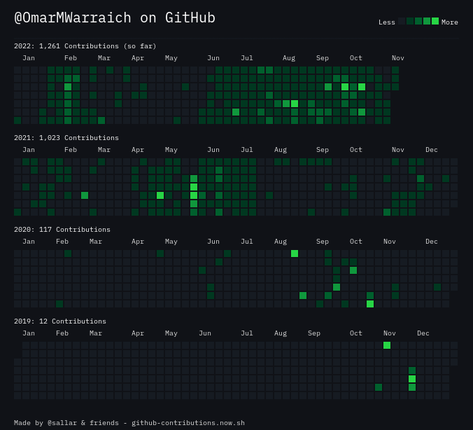

# 👋 Hi, I'm Omar Warraich

### Full-Stack Developer · AI & Blockchain Engineer · Founder at Top Gear Technologies LLC

I build production-minded web applications, AI-powered tools, developer platforms, and blockchain products. My work spans **TypeScript, Python, Ruby on Rails, cloud infrastructure, LLM applications, GPU engineering, and decentralized systems**.

  
  
  
  

---

## 🧭 What I Do

- **Product engineering:** Design and ship full-stack applications from idea to deployment.
- **AI engineering:** Build LLM, RAG, OCR, transcription, agent, and AI-enabled learning workflows.
- **Blockchain engineering:** Develop DeFi, NFT, smart-contract, wallet, and on-chain analytics experiences.
- **Cloud-native systems:** Work with APIs, containers, CI/CD, AWS, Kubernetes, observability, and scalable backends.
- **Technical leadership:** Lead projects and deliver solutions through Top Gear Technologies LLC and independent consulting.

## 🛠️ Core Technologies

<table>
  <tr>
    <td valign="top" width="33%"><strong>Languages</strong> TypeScript · JavaScript · Python · Ruby · Go · Rust · C/C++ · Java · SQL · Bash</td>
    <td valign="top" width="33%"><strong>Application Development</strong> React · Next.js · Node.js · NestJS · Ruby on Rails · FastAPI · Flask · Gin · Spring Boot</td>
    <td valign="top" width="33%"><strong>AI & Data</strong> LLM applications · RAG · AI agents · OpenAI API · Hugging Face · OCR · Speech-to-text · Jupyter</td>
  </tr>
  <tr>
    <td valign="top"><strong>Blockchain & Web3</strong> Solidity · Ethereum · DeFi · NFTs · Ethers.js · Web3.js · Hardhat · Wagmi</td>
    <td valign="top"><strong>Data & Infrastructure</strong> PostgreSQL · MongoDB · MySQL · Redis · Docker · Kubernetes · AWS · Vercel · Fly.io</td>
    <td valign="top"><strong>Quality & Operations</strong> CI/CD · GitHub Actions · RSpec · Jest · PyTest · React Testing Library · Sentry · Datadog</td>
  </tr>
</table>

---

## 🚀 Selected Work

### AI, Developer Tools & GPU Engineering

- [**PDF HTML**](https://github.com/OmarMWarraich/pdf-html) — Converts text-based PDFs into self-contained HTML while preserving text and source typography.
- [**OCR API**](https://github.com/OmarMWarraich/ocr-api) — FastAPI service for extracting text from images with OCR.
- [**LLM Inference & Serving Tutorial**](https://github.com/OmarMWarraich/llm-inference-and-serving-tutorial) — Practical material for serving and operating language models.
- [**GPU Kernel Engineering Tutorial**](https://github.com/OmarMWarraich/gpu-kernel-engineering-tutorial) — CUDA-focused learning and kernel engineering work.
- [**MCP Integration**](https://github.com/OmarMWarraich/mcp_integration) · [**LoPilot**](https://github.com/OmarMWarraich/lopilot) — Experiments with modern AI tooling and developer workflows.

### Blockchain, DeFi & Web3

- [**Advanced Analytics**](https://github.com/OmarMWarraich/advanced-analytics) — Crypto intelligence platform for on-chain, market, and sentiment signals.
- [**Next.js NFT Marketplace**](https://github.com/OmarMWarraich/next15-nft-marketplace) — Full-stack NFT marketplace built with Next.js, React, TypeScript, Tailwind CSS, and Hardhat.
- [**Uniswap Clone**](https://github.com/OmarMWarraich/uniswap_clone) — Decentralized exchange experience with liquidity pools and wallet integration.
- [**DeFi Aave**](https://github.com/OmarMWarraich/defi-aave) · [**EigenLayer MCP**](https://github.com/OmarMWarraich/eigenlayer-mcp) · [**Blockchain Capstone**](https://github.com/OmarMWarraich/Blockchain-Capstone)

### Product & Full-Stack Applications

- [**AI Marketing Platform**](https://github.com/OmarMWarraich/nextjs-ai-marketing-platform) — AI-enabled marketing product built with TypeScript and Next.js.
- [**AI Learning Journey**](https://github.com/OmarMWarraich/ai-learning-journey) — AI SaaS platform for generating personalized learning courses.
- [**Agents Production**](https://github.com/OmarMWarraich/agents-production) — Production-oriented AI agent experiments and implementation patterns.
- [**Go Fitness API**](https://github.com/OmarMWarraich/femProject) — Authenticated REST API using Go, PostgreSQL, and clean architecture principles.
- [**Rails + React Application**](https://github.com/OmarMWarraich/ror-react-app) · [**Chronicles**](https://github.com/OmarMWarraich/chronicles) · [**Idea App**](https://github.com/OmarMWarraich/Idea_App)

> Explore the complete project portfolio in my [GitHub repositories](https://github.com/OmarMWarraich?tab=repositories).

---

## 📊 GitHub Activity

  
  

  

  

---

## 🏅 Highlights

- GitHub Arctic Code Vault Contributor
- GitHub Pull Shark, Quickdraw, and YOLO achievements
- 447 public repositories and 756 public repository stars at the time of this update
- Certified across blockchain, cloud, AI/ML, data science, and full-stack development
- Open to new opportunities and collaborations

---

## ✍️ Writing & Learning

I write about practical software engineering, cloud infrastructure, Ruby on Rails, AI applications, and developer tooling on [Medium](https://medium.com/@omarmohammad_89249). Recent topics include Phoenix, Kafka, Rails, cloud-native development, Node.js, and OpenAI integrations.

- [Medium profile](https://medium.com/@omarmohammad_89249)
- [Rails 7 Devise API Authentication](https://medium.com/@omarmohammad_89249/rails7-devise-api-authentication-with-vue-js-2fcbab3e3fb8)

---

## 🤝 Let's Connect

- 💼 [LinkedIn](https://www.linkedin.com/in/o-va/)
- 🌐 [Portfolio](https://ova-portfolio.vercel.app/)
- 🏢 [Top Gear Technologies LLC](https://top-gear-technologies-llc.vercel.app/)
- 𝕏 [X / Twitter](https://x.com/omarwarraich1)
- 📧 [Email](mailto:omarwarraich@hotmail.com)

If you are building something ambitious in **AI, blockchain, developer tools, or cloud-native software**, feel free to reach out.

---

  

